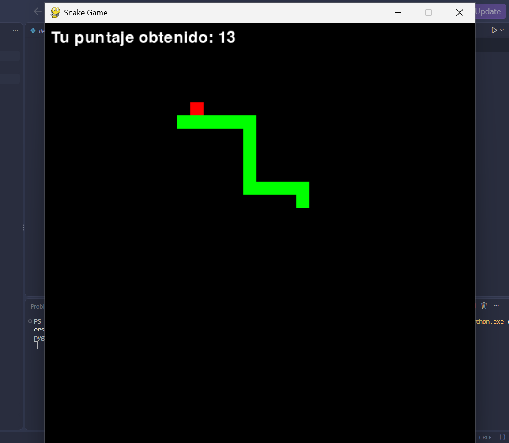

# Snake Game

Juego de la serpiente hecho en Python con Pygame.

## Cómo jugar

1. Instala Pygame: `pip install pygame`
2. Corre el juego: `python desarrollo.py`

## Controles

- **Flechas** para mover la serpiente
- Comé la comida roja para sumar puntos
- Si chocás con la pared o con vos mismo, perdes
